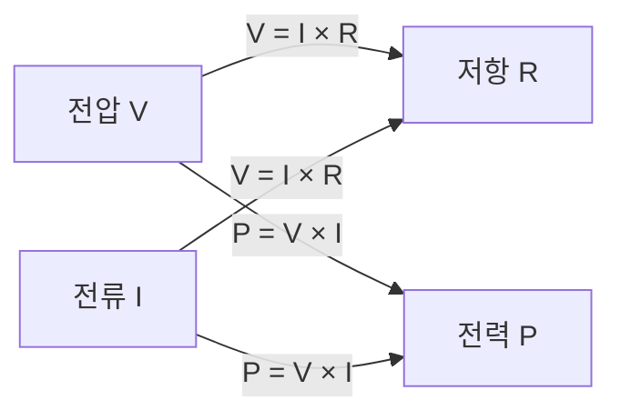

# 🔌 기본 회로소자와 전기회로

> 전자공학과 2학년 학부 수준의 회로이론 기초 정리

---

## 📚 목차
1. [회로란 무엇인가](#1-회로란-무엇인가)
2. [수동 소자 개요](#2-수동-소자-개요)
3. [전원 소자](#3-전원-소자)
4. [전기적 물리량](#4-전기적-물리량)
5. [직렬 및 병렬 회로](#5-직렬-및-병렬-회로)
6. [오옴의 법칙과 전력 계산](#6-오옴의-법칙과-전력-계산)

---

## 1. 회로란 무엇인가

### 📌 정의
**전기회로(Electric Circuit)**는 전류가 흐를 수 있는 닫힌 경로를 의미합니다.

### 🎯 회로의 역할
- **에너지 전달**: 전원에서 부하로 전기 에너지 전달
- **신호 처리**: 정보를 담은 전기 신호의 변환 및 처리
- **제어**: 전압, 전류의 크기와 방향 제어

### 🔧 회로의 기본 구성 요소
```
[전원] ──── [도선] ──── [부하(소자)] ──── [도선] ──── [전원]
```

| 구성 요소 | 역할 |
|-----------|------|
| **전원** | 전기 에너지 공급 |
| **도선** | 전류의 경로 제공 |
| **부하** | 전기 에너지 소비 또는 저장 |

---

## 2. 수동 소자 개요

### 📊 수동 소자(Passive Elements)란?
외부 전원 없이는 에너지를 공급할 수 없는 소자

### 2.1 저항 (Resistor) - 중점 설명

#### 🔍 정의
전류의 흐름을 방해하여 전기 에너지를 열에너지로 변환하는 소자

#### 📐 기호 및 표시
```
───[////]───  또는  ───[▭]───
     R              R
```

#### 📏 단위
- **기본 단위**: Ω (Ohm, 옴)
- **단위 변환**:
  ```
  1 kΩ = 1,000 Ω
  1 MΩ = 1,000,000 Ω
  ```

#### 🎯 저항의 역할
1. **전류 제한**: 회로에 흐르는 전류의 크기 조절
2. **전압 분배**: 직렬 연결 시 전압을 나누어 분배
3. **에너지 소비**: 전기 에너지를 열로 변환

#### 📊 관련 수식
| 관계식 | 설명 |
|--------|------|
| **V = I × R** | 옴의 법칙 |
| **P = I² × R** | 소비 전력 (전류 기준) |
| **P = V² / R** | 소비 전력 (전압 기준) |
| **G = 1 / R** | 컨덕턴스 (S, 지멘스) |

#### 💡 실제 예시
- LED 회로의 전류 제한 저항
- 전압 분배기 회로
- Pull-up/Pull-down 저항

### 2.2 기타 수동 소자 (간단 언급)

#### 커패시터 (Capacitor)
- **역할**: 전하를 저장하여 전기장 에너지 저장
- **기호**: ──||──
- **단위**: F (Farad)

#### 인덕터 (Inductor)
- **역할**: 자기장 에너지 저장
- **기호**: ──🌀──
- **단위**: H (Henry)

> 💡 커패시터와 인덕터의 자세한 내용은 이후 장에서 다룹니다.

---

## 3. 전원 소자

### 3.1 전압원 (Voltage Source)

#### 📌 정의
일정한 전압을 유지하는 이상적인 전원

#### 🔋 특징
- 부하에 관계없이 일정한 전압 유지
- 이상적인 경우 내부 저항 = 0

#### 📐 기호
```
  ⊕─────  (DC 전압원)
  ─────
  
  ~─────  (AC 전압원)
```

### 3.2 전류원 (Current Source)

#### 📌 정의
일정한 전류를 공급하는 이상적인 전원

#### 🔋 특징
- 부하에 관계없이 일정한 전류 유지
- 이상적인 경우 내부 저항 = ∞

#### 📐 기호
```
  ──(↑)──  (전류원)
```

### 📊 전압원 vs 전류원 비교

| 특성 | 전압원 | 전류원 |
|------|--------|--------|
| **제어량** | 전압 (V) | 전류 (I) |
| **내부 저항** | 0 (이상적) | ∞ (이상적) |
| **부하 변화 시** | 전류 변화 | 전압 변화 |
| **실제 예** | 배터리, 어댑터 | 정전류 LED 드라이버 |

---

## 4. 전기적 물리량

### 4.1 전압 (Voltage, V)

#### 📌 정의
두 점 사이의 전위차 (전기적 위치 에너지 차이)

#### 📏 특성
- **단위**: V (Volt)
- **측정**: 전압계로 병렬 측정
- **비유**: 물의 높이 차이 (수압)

### 4.2 전류 (Current, I)

#### 📌 정의
단위 시간당 흐르는 전하량

#### 📏 특성
- **단위**: A (Ampere)
- **측정**: 전류계로 직렬 측정
- **비유**: 물의 흐름량
- **수식**: I = Q / t (Q: 전하량, t: 시간)

### 4.3 저항 (Resistance, R)

#### 📌 정의
전류의 흐름을 방해하는 정도

#### 📏 특성
- **단위**: Ω (Ohm)
- **측정**: 저항계 사용
- **비유**: 파이프의 굵기

### 4.4 전력 (Power, P)

#### 📌 정의
단위 시간당 소비되거나 공급되는 에너지

#### 📏 특성
- **단위**: W (Watt)
- **수식**: P = V × I
- **의미**: 에너지 변환율

### 📊 물리량 간의 관계



| 관계식 | 의미 |
|--------|------|
| **V = I × R** | 전압은 전류와 저항의 곱 |
| **I = V / R** | 전류는 전압에 비례, 저항에 반비례 |
| **P = V × I** | 전력은 전압과 전류의 곱 |
| **P = I² × R** | 저항에서의 소비 전력 |
| **P = V² / R** | 저항에서의 소비 전력 (전압 기준) |

---

## 5. 직렬 및 병렬 회로

### 5.1 직렬 회로 (Series Circuit)

#### 📌 정의
소자들이 하나의 경로로 연결된 회로

#### 🔗 특징
```
──[R1]──[R2]──[R3]──
```

- **전류**: 모든 소자에 동일한 전류 흐름
- **전압**: 각 소자의 전압 합 = 전체 전압

#### 📐 등가 저항 계산
```
Req = R1 + R2 + R3 + ... + Rn
```

#### 💡 예시
- R1 = 100Ω, R2 = 200Ω, R3 = 300Ω
- Req = 100 + 200 + 300 = **600Ω**

### 5.2 병렬 회로 (Parallel Circuit)

#### 📌 정의
소자들이 여러 경로로 나뉘어 연결된 회로

#### 🔗 특징
```
    ┌─[R1]─┐
────┼─[R2]─┼────
    └─[R3]─┘
```

- **전압**: 모든 소자에 동일한 전압 인가
- **전류**: 각 소자의 전류 합 = 전체 전류

#### 📐 등가 저항 계산
```
1/Req = 1/R1 + 1/R2 + 1/R3 + ... + 1/Rn
```

또는 두 저항의 경우:
```
Req = (R1 × R2) / (R1 + R2)
```

#### 💡 예시
- R1 = 100Ω, R2 = 100Ω
- Req = (100 × 100) / (100 + 100) = **50Ω**

### 📊 직렬 vs 병렬 비교

| 특성 | 직렬 회로 | 병렬 회로 |
|------|-----------|-----------|
| **전류** | 모든 소자 동일 | 분배됨 |
| **전압** | 분배됨 | 모든 소자 동일 |
| **등가 저항** | 합 (증가) | 역수의 합 (감소) |
| **하나 고장 시** | 전체 차단 | 다른 경로 정상 |

---

## 6. 오옴의 법칙과 전력 계산

### 6.1 오옴의 법칙 (Ohm's Law)

#### 📌 기본 공식
```
V = I × R
```

#### 🔄 변형 공식
- **전류 계산**: I = V / R
- **저항 계산**: R = V / I

### 6.2 전력 계산

#### 📌 기본 공식
```
P = V × I
```

#### 🔄 오옴의 법칙을 이용한 변형
- **전류 기준**: P = I² × R
- **전압 기준**: P = V² / R

### 📊 통합 공식 정리

| 구하려는 값 | 주어진 값 | 공식 |
|------------|-----------|------|
| **전압 (V)** | I, R | V = I × R |
| **전압 (V)** | P, I | V = P / I |
| **전압 (V)** | P, R | V = √(P × R) |
| **전류 (I)** | V, R | I = V / R |
| **전류 (I)** | P, V | I = P / V |
| **전류 (I)** | P, R | I = √(P / R) |
| **저항 (R)** | V, I | R = V / I |
| **저항 (R)** | V, P | R = V² / P |
| **저항 (R)** | I, P | R = P / I² |
| **전력 (P)** | V, I | P = V × I |
| **전력 (P)** | I, R | P = I² × R |
| **전력 (P)** | V, R | P = V² / R |

### 💡 실전 예제

#### 예제 1: LED 회로 설계
- 전원: 5V
- LED 순방향 전압: 2V
- LED 권장 전류: 20mA

**저항값 계산:**
```
R = (V전원 - VLED) / I
R = (5V - 2V) / 0.02A = 150Ω
```

#### 예제 2: 저항의 소비 전력
- 저항: 1kΩ
- 인가 전압: 10V

**소비 전력 계산:**
```
P = V² / R = 10² / 1000 = 0.1W = 100mW
```

---

## 📝 핵심 요약

1. **회로**는 전류가 흐르는 닫힌 경로
2. **저항**은 전류를 제한하고 전압을 분배
3. **전압원**은 일정 전압을, **전류원**은 일정 전류를 공급
4. **V = I × R** (오옴의 법칙)이 모든 계산의 기본
5. **직렬**은 전류 동일/전압 분배, **병렬**은 전압 동일/전류 분배
6. **P = V × I**로 전력 계산

---

## 🎯 다음 학습 내용
- 커패시터와 인덕터의 특성
- 키르히호프의 법칙
- 교류 회로 해석
- 과도 응답 분석

---

> 📖 이 문서는 전자공학과 2학년 학부생을 위한 회로이론 기초 자료입니다.
